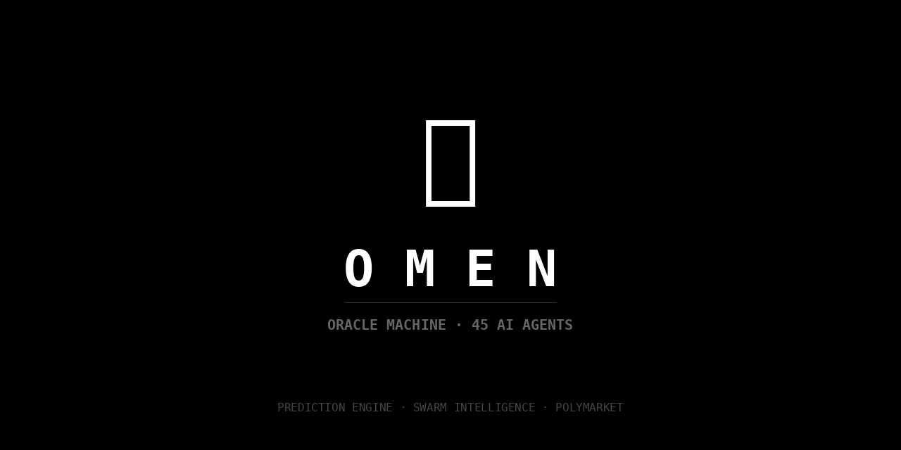
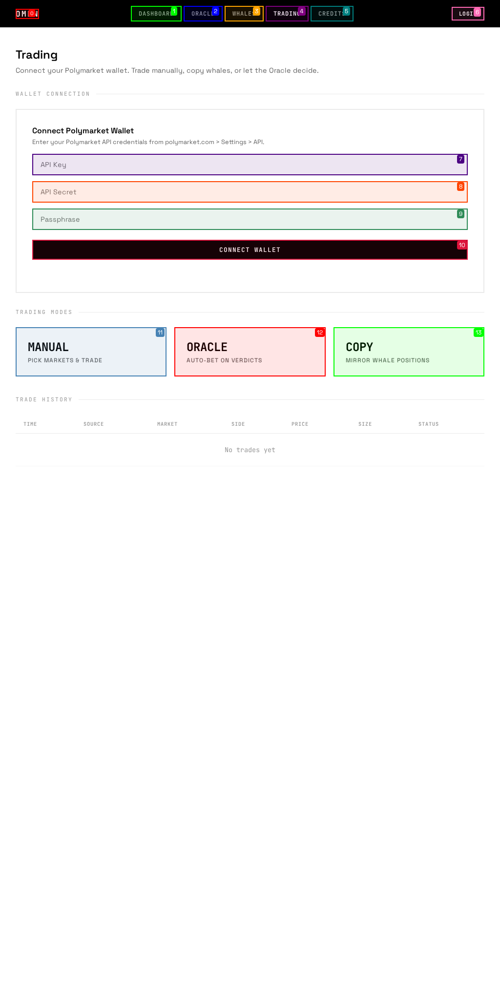

<p align="center">
  
</p>

<h1 align="center">🔮 OMEN — The Oracle Machine</h1>

<p align="center">
  <strong>Thousands of AI minds debate. One verdict. You profit.</strong>
</p>

<p align="center">
  <a href="#features"></a>
  <a href="#whale-intelligence"></a>
  <a href="#pricing"></a>
  <a href="#quick-start"></a>
</p>

<p align="center">
  <a href="https://person-rhythm-application-kinase.trycloudflare.com" target="_blank"><strong>🌐 Live Demo</strong></a> •
    <a href="#quick-start">Quick Start</a> •
  <a href="#features">Features</a> •
  <a href="#how-it-works">How It Works</a> •
  <a href="#pricing">Pricing</a> •
  <a href="#trading">Trading</a> •
  <a href="docs/API.md">API Docs</a>
</p>

---

## 🌐 Live Demo

> **[➡️ Try OMEN Live](https://person-rhythm-application-kinase.trycloudflare.com)**
>
> Full access to the AI Oracle, Auto-Pilot, Backtesting, Whale Tracking, and more.


## 🎯 What is OMEN?

OMEN is an **AI-powered prediction and copy-trading platform** for [Polymarket](https://polymarket.com). It combines:

- 🧠 **Swarm Intelligence** — 1,200 AI agents debate outcomes and reach consensus
- 🐋 **Whale Intelligence** — Live on-chain tracking of top Polymarket wallets on Polygon
- 📊 **Real Trading** — Manual, Oracle-driven, and copy-trade execution via Polymarket CLOB
- 💰 **Crypto Payments** — Pay with MATIC/USDC on Polygon. No subscriptions.

> Users don't configure APIs. They don't set up models. They don't study charts.
> They ask OMEN a question. The swarm deliberates. A verdict appears.
> Then one button: **"Bet with the Oracle."**

---

## 📸 Screenshots

<p align="center">
  
  <br><em>Dashboard — System overview with quick Oracle access</em>
</p>

<table>
  <tr>
    <td align="center"><strong>🔮 Oracle War Room</strong></td>
    <td align="center"><strong>🐋 Whale Tracker</strong></td>
  </tr>
  <tr>
    <td></td>
    <td></td>
  </tr>
  <tr>
    <td align="center"><em>5 AI agents debate live, 1,200-dot swarm matrix votes</em></td>
    <td align="center"><em>Live on-chain whale tracking on Polygon</em></td>
  </tr>
  <tr>
    <td align="center"><strong>📊 Trading</strong></td>
    <td align="center"><strong>💳 Credits</strong></td>
  </tr>
  <tr>
    <td></td>
    <td></td>
  </tr>
  <tr>
    <td align="center"><em>Manual, Oracle auto-trade, and whale copy-trade</em></td>
    <td align="center"><em>Crypto payments on Polygon with tiered credit packages</em></td>
  </tr>
</table>

---

## ✨ Features

### 🔮 Oracle Chamber — Real AI Debates

The Oracle uses a **5-agent swarm** powered by **Gemini 2.0 Flash** with distinct personalities:

| Agent | Role | Style |
|-------|------|-------|
| 🟢 **Atlas** | Bull Analyst | Finds reasons to buy |
| 🔴 **Nemesis** | Bear Analyst | Finds reasons to sell |
| 🔵 **Quant** | Statistician | Pure data and probability |
| 🟡 **Maverick** | Contrarian | Challenges consensus |
| 🟣 **Clio** | Historian | Historical patterns and precedent |

Agents make **real LLM API calls** → Debate independently → Vote → 1,200-dot swarm matrix animates → Verdict with confidence score.

### ⚔️ War Room — 1,200 AI Agents Vote Live

- Each agent card reveals sequentially with real AI reasoning
- **1,200-dot swarm matrix** with ripple animation shows consensus forming
- Green = YES, Red = NO — watch the swarm converge in real-time
- Whale agreement dots overlay for confidence boost
- Final verdict card with confidence percentage

### 🐋 Whale Intelligence — Live On-Chain

- **Live Polygon blockchain tracking** via `polygon-bor-rpc.publicnode.com`
- Real MATIC and USDC balances for tracked wallets
- Transaction count and recent volume monitoring
- **Polymarket CTF Exchange detection** — flags trades to Polymarket contracts
- DB whales with historical stats: win rate, PnL, volume, specialty
- **Copy any whale** — one click to mirror their latest trade

### 📊 Trading — Three Modes

| Mode | Description |
|------|-------------|
| **Manual** | Browse live Polymarket markets → select → set price/size → place limit order |
| **Oracle Auto-Trade** | Ask Oracle → AI analyzes → auto-places bet on matching Polymarket market |
| **Copy Trade** | Enter whale address → mirrors their latest Polymarket position |

**Safety built-in:**
- 🔒 **API-only credentials** — no private keys stored, only Polymarket API creds
- 📊 **Liquidity check** — rejects trades on illiquid orderbooks (spread > $0.50)
- 🛡️ **Risk controls** — max bet $50, daily limit $200, stop-loss 35%
- 🔐 **Fernet encryption** — all credentials encrypted at rest

### 💰 Crypto Payments — Polygon

- **Wallet:** `0x135C480C813451eF443A2F60cfaD49EA7197B855`
- **Accepted:** MATIC, USDC, USDC.e on Polygon
- **Verification:** On-chain transaction hash verification via Polygon RPC
- **Auto-credit:** Credits added automatically after blockchain confirmation

---

## 🏗️ How It Works

```
┌─ USER ──────────────────────────────────────────────────┐
│  "Will Bitcoin exceed $150k by end of 2026?"            │
└──────────────────────┬──────────────────────────────────┘
                       │
┌──────────────────────▼──────────────────────────────────┐
│                 🔮 ORACLE ENGINE                        │
│           Gemini 2.0 Flash via OpenRouter               │
│                                                         │
│  ┌─────────┐ ┌─────────┐ ┌─────────┐ ┌─────┐ ┌─────┐  │
│  │  Atlas   │ │ Nemesis │ │  Quant  │ │ Mav │ │Clio │  │
│  │  (Bull)  │ │ (Bear)  │ │ (Stats) │ │     │ │     │  │
│  └────┬─────┘ └────┬────┘ └────┬────┘ └──┬──┘ └──┬──┘  │
│       └────────────┼──────────┼─────────┼───────┘      │
│                    ▼          ▼         ▼              │
│         ╔════════════════════════════════════╗          │
│         ║  1,200 SWARM AGENTS VOTE           ║          │
│         ║  663 YES / 537 NO                  ║          │
│         ╚════════════════════════════════════╝          │
│                         │                              │
│              ╔══════════▼════════════════╗              │
│              ║  VERDICT: YES — 72%       ║              │
│              ╚═══════════════════════════╝              │
└──────────────────────┬──────────────────────────────────┘
                       │
┌──────────────────────▼──────────────────────────────────┐
│                 🐋 WHALE LAYER (Polygon)                │
│  Live blockchain tracking via RPC                       │
│  Whale agreement: 5/8 → Confidence BOOST                │
└──────────────────────┬──────────────────────────────────┘
                       │
┌──────────────────────▼──────────────────────────────────┐
│                 📊 TRADING ENGINE                        │
│  Manual | Oracle Auto-Trade | Copy Trade                │
│  User's Polymarket API → py-clob-client → CLOB          │
└──────────────────────┬──────────────────────────────────┘
                       │
┌──────────────────────▼──────────────────────────────────┐
│                 💰 PAYMENT LAYER                         │
│  Polygon blockchain: MATIC/USDC → On-chain verify       │
└─────────────────────────────────────────────────────────┘
```

---

## 💰 Pricing

### Getting Started — 50 Free Credits

Every new account gets **50 free credits** to try everything.

### Credit Packages (Crypto — Polygon)

| Package | Credits | Price | Rate |
|---------|---------|-------|------|
| **Starter** | 50 credits | $5 | 10 credits/$1 |
| ⭐ **Popular** | 120 credits | $10 | 12 credits/$1 |
| **Pro** | 300 credits | $20 | 15 credits/$1 |
| 🐋 **Whale** | 1,000 credits | $50 | 20 credits/$1 |

### What Credits Cost

| Action | Cost |
|--------|------|
| 🔮 **Oracle Prediction** | 1 credit |
| 🐋 **Whale Deep Dive** | 1 credit |
| 🤖 **Auto-Trade Bet** | 2 credits |
| 🏆 **Leaderboard** | Free |

---

## 🚀 Quick Start

### Quick Deploy (Recommended)

```bash
git clone https://github.com/Mecasa-hub/omen.git
cd omen
cp .env.example .env  # Add your OpenRouter API key
pip install aiosqlite httpx aiohttp pydantic uvicorn fastapi cryptography py-clob-client
python -m uvicorn deploy:app --host 0.0.0.0 --port 8888
# OMEN is live at http://localhost:8888
```

### Docker

```bash
git clone https://github.com/Mecasa-hub/omen.git
cd omen
cp .env.example .env
docker-compose up -d
```

### Environment Variables

```env
# Required
OPENROUTER_API_KEY=your-openrouter-key
LLM_MODEL=google/gemini-2.0-flash-001

# Payment wallet (pre-configured)
PAYMENT_WALLET=0x135C480C813451eF443A2F60cfaD49EA7197B855

# Polymarket (users provide their own API keys in the UI)
# No server-side trading keys needed
```

---

## 📁 Project Structure

```
omen/
├── deploy.py           # FastAPI app — all routes + Oracle engine (31KB)
├── ui.html             # MiroFish-inspired frontend (37KB)
├── trading.py          # Polymarket CLOB trading module (14KB)
├── whale_tracker.py    # Live Polygon blockchain whale tracking
├── payments.py         # Polygon crypto payment verification
├── .env                # API keys and configuration
├── data/               # SQLite database
├── docs/
│   ├── screenshots/    # Dashboard, Oracle, Whales, Trading, Credits
│   ├── API.md          # Full API reference
│   ├── ARCHITECTURE.md # System design
│   ├── DEPLOYMENT.md   # Production setup guide
│   ├── CREDITS.md      # Credit system mechanics
│   └── VIRAL_STRATEGY.md
├── backend/            # Original modular backend (reference)
├── frontend/           # Vue 3 source (optional)
├── tests/              # Test suite
├── scripts/            # DB migration, whale seeding
├── docker-compose.yml
└── README.md
```

---

## 🛠️ Tech Stack

| Layer | Technology |
|-------|------------|
| **Backend** | FastAPI, Python 3.11+, aiosqlite |
| **Frontend** | Embedded HTML/CSS/JS (MiroFish aesthetic) |
| **AI Engine** | Gemini 2.0 Flash via OpenRouter (multi-agent swarm) |
| **Trading** | py-clob-client → Polymarket CLOB API |
| **Blockchain** | Polygon RPC (whale tracking + payment verification) |
| **Payments** | MATIC/USDC on Polygon (on-chain verification) |
| **Security** | JWT auth, Fernet-encrypted credentials |
| **Fonts** | JetBrains Mono + Space Grotesk |

---

## 🗺️ Roadmap

#
### 🧠 Phase 3: Intelligence Suite

| Feature | Description |
|---------|-------------|
| **Advanced Swarm** | 45 AI agents across 9 categories (Technical, Macro, Sentiment, Crypto, Sports, Risk, Timing, Fundamental) |
| **Auto-Pilot** | Fully automated trading with 3 risk profiles (Conservative, Balanced, Aggressive) |
| **Backtesting** | Test Oracle accuracy against real resolved Polymarket markets |
| **Portfolio Tracker** | Track positions, PnL, win rate, trade breakdown |
| **Alert System** | Real-time notifications for whale moves, Oracle streaks, trade results |
| **Whale Discovery** | Auto-detect profitable wallets from Polymarket trade data |

## ✅ Phase 1 — Foundation (Complete)
- [x] 🔮 Oracle Engine with 5-agent AI swarm (Gemini 2.0 Flash)
- [x] 🎨 MiroFish-inspired minimal UI (black & white theme)
- [x] ⚔️ War Room with 1,200-dot animated swarm matrix
- [x] 🐋 Live whale tracking on Polygon blockchain
- [x] 💰 Crypto payments (MATIC/USDC on Polygon)
- [x] 📊 Polymarket market discovery via Gamma API
- [x] 🔐 JWT authentication + encrypted credential storage
- [x] 📈 Dashboard with system stats

### ✅ Phase 2 — Trading (Complete)
- [x] 📊 Manual trading via Polymarket CLOB
- [x] 🔮 Oracle auto-trade (AI verdict → auto-bet)
- [x] 🐋 Copy trading (mirror whale positions)
- [x] 🛡️ Liquidity checks + risk controls
- [x] 🔐 Per-user encrypted API credential storage
- [x] 📜 Trade history logging

### 🔨 Phase 3 — Intelligence (Complete)
- [ ] 🧬 Advanced swarm — 50+ agent personas with specialized strategies
- [ ] 📊 Backtesting engine — test strategies against historical data
- [ ] 🐋 Whale discovery — auto-detect new profitable wallets
- [ ] 📈 Portfolio tracker — aggregate positions, PnL, win rate
- [ ] 🔔 Alert system — whale moves, Oracle streaks, market events

### 🔮 Phase 4 — Scale
- [ ] 🤖 Auto-pilot mode — fully automated trading based on Oracle + whales
- [ ] 📱 Mobile app (React Native)
- [ ] 🌐 Multi-chain support (Azuro, Overtime Markets)
- [ ] 💬 AI chat assistant with memory per user
- [ ] 🤖 Telegram bot for alerts and quick trades
- [ ] 🎬 Brag cards + social sharing for viral growth

### 🌍 Phase 5 — Ecosystem
- [ ] 🏪 Whale marketplace — subscribe to top traders' strategies
- [ ] 🏆 Public leaderboard with SEO optimization
- [ ] 🤝 Referral system — 10% credit bonus for invites
- [ ] 🐦 X/Twitter whale alert bot
- [ ] 🌍 Multi-language support
- [ ] 🏛️ DAO governance for platform decisions

---

## 📚 Documentation

| Doc | Description |
|-----|-------------|
| [Architecture](docs/ARCHITECTURE.md) | System design & data flow |
| [API Reference](docs/API.md) | All endpoints with examples |
| [Deployment Guide](docs/DEPLOYMENT.md) | Production setup |
| [Credit System](docs/CREDITS.md) | Pay-as-you-go mechanics |
| [Viral Strategy](docs/VIRAL_STRATEGY.md) | Growth hacking playbook |

---

## 📄 License

MIT License — see [LICENSE](LICENSE) for details.

---

<p align="center">
  <strong>🔮 The swarm has spoken. Will you listen?</strong>
</p>

<p align="center">
  <a href="https://github.com/Mecasa-hub/omen">⭐ Star this repo</a> •
  <a href="https://github.com/Mecasa-hub/omen/issues">🐛 Report Bug</a> •
  <a href="https://github.com/Mecasa-hub/omen/issues">💡 Request Feature</a>
</p>
