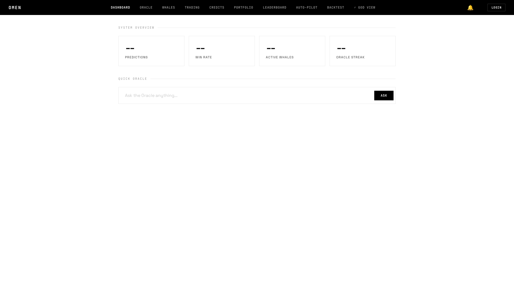
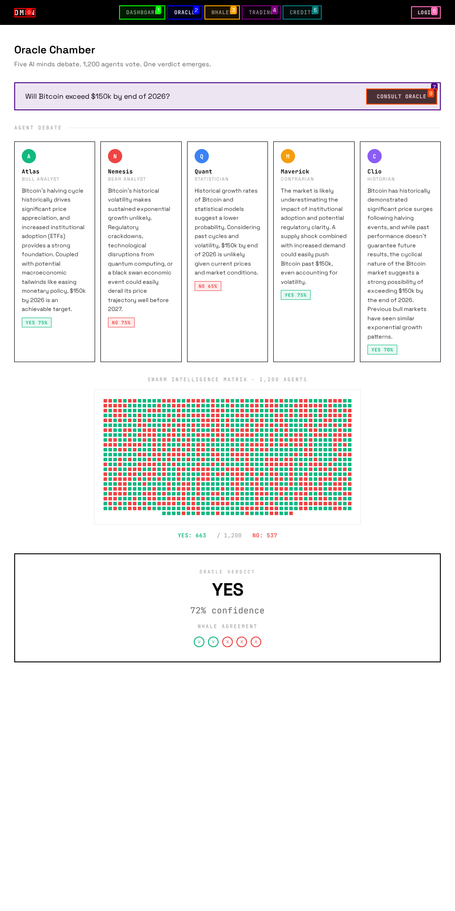

<div align="center">

# 🔮 OMEN — The Oracle Machine

### *Where Artificial Intelligence Meets Market Prophecy*

[](LICENSE)
[](https://python.org)
[](https://vuejs.org)
[](https://fastapi.tiangolo.com)
[](docker-compose.yml)
[](CONTRIBUTING.md)

<br/>

```
   ██████╗ ███╗   ███╗███████╗███╗   ██╗
  ██╔═══██╗████╗ ████║██╔════╝████╗  ██║
  ██║   ██║██╔████╔██║█████╗  ██╔██╗ ██║
  ██║   ██║██║╚██╔╝██║██╔══╝  ██║╚██╗██║
  ╚██████╔╝██║ ╚═╝ ██║███████╗██║ ╚████║
   ╚═════╝ ╚═╝     ╚═╝╚══════╝╚═╝  ╚═══╝
       T H E   O R A C L E   M A C H I N E
```

*A thousand AI agents debate. The whales reveal their hands. OMEN delivers the verdict.*

[Live Demo](https://omen.ai) · [Documentation](docs/) · [API Reference](docs/API.md) · [Discord](https://discord.gg/omen)

---

</div>

## 🌑 What is OMEN?

**OMEN** is an AI-powered prediction intelligence and copy-trading platform for [Polymarket](https://polymarket.com) — the world\'s largest prediction market.

Imagine having a **war room of a thousand AI agents** debating every angle of every event — sports, politics, crypto, world affairs — then cross-referencing their verdict against **real whale wallet intelligence** from the sharpest traders on Polymarket.

That\'s OMEN.

```
┌─────────────────────────────────────────────────────────────────────┐
│                        USER ASKS A QUESTION                        │
│                 "Will Bitcoin hit $150k by July?"                   │
└──────────────────────────────┬──────────────────────────────────────┘
                               │
                               ▼
┌──────────────────────────────────────────────────────────────────────┐
│                     🔮 THE ORACLE ENGINE                            │
│                                                                      │
│   ┌─────────────┐  ┌─────────────┐  ┌─────────────┐                │
│   │  📊 Analyst  │  │  🐂 Bull    │  │  🐻 Bear    │   x1000       │
│   │   Agent #1   │  │  Agent #2   │  │  Agent #3   │   agents      │
│   └──────┬──────┘  └──────┬──────┘  └──────┬──────┘                │
│          │                │                │                         │
│          └────────────────┼────────────────┘                         │
│                           ▼                                          │
│                  ┌─────────────────┐                                 │
│                  │  🏛️ VERDICT     │                                 │
│                  │  73% YES        │                                 │
│                  │  Confidence: 8/10│                                │
│                  └────────┬────────┘                                 │
│                           │                                          │
└───────────────────────────┼──────────────────────────────────────────┘
                            │
                            ▼
┌──────────────────────────────────────────────────────────────────────┐
│                    🐋 WHALE INTELLIGENCE                             │
│                                                                      │
│   Top 50 wallets monitored in real-time                              │
│   ┌──────────────────────────────────────────────┐                   │
│   │  🐋 Whale #1: $2.4M YES position (73%)      │                   │
│   │  🐋 Whale #2: $890K YES position (71%)       │                   │
│   │  🐋 Whale #3: $1.1M NO position (62%)        │                   │
│   │  ────────────────────────────────────         │                   │
│   │  Whale Consensus: 68% YES                    │                   │
│   └──────────────────────────────────────────────┘                   │
│                           │                                          │
└───────────────────────────┼──────────────────────────────────────────┘
                            │
                            ▼
┌──────────────────────────────────────────────────────────────────────┐
│                    ⚡ AUTO-EXECUTION                                  │
│                                                                      │
│   Oracle: 73% YES  ×  Whales: 68% YES  =  STRONG BUY               │
│                                                                      │
│   → Placing $50 on YES @ $0.71                                      │
│   → Stop-loss: -25%                                                  │
│   → Take-profit: Market resolution                                   │
│                                                                      │
└──────────────────────────────────────────────────────────────────────┘
```

## ✨ Features

| Feature | Status | Description |
|---------|--------|-------------|
| 🔮 Oracle Predictions | `✅ Live` | AI swarm debates with thousands of agents |
| 🐋 Whale Intelligence | `✅ Live` | Real-time monitoring of top Polymarket wallets |
| ⚡ Auto-Execution | `✅ Live` | Place bets automatically based on Oracle + Whale consensus |
| 💬 AI Chat | `✅ Live` | Per-user AI assistant with memory and context |
| 🎴 Brag Cards | `✅ Live` | Auto-generated shareable win cards |
| 📊 War Room | `✅ Live` | Watch AI agents debate in real-time via WebSocket |
| 🏆 Whale Leaderboard | `✅ Live` | Track and rank the best Polymarket whales |
| 🤖 Copy Trading | `✅ Live` | Mirror whale positions automatically |
| 💳 Credit System | `✅ Live` | Pay-as-you-go predictions (no subscriptions) |
| 🐦 X/Twitter Bot | `✅ Live` | Whale alert and prediction bot |
| 🔗 Referral System | `✅ Live` | Earn credits by inviting friends |
| 🛡️ Risk Manager | `✅ Live` | Position limits, daily loss limits, circuit breakers |

## 💰 Revenue Model

OMEN uses a **pay-as-you-go** model — no subscriptions, no lock-in:

| Revenue Stream | Rate | Description |
|----------------|------|-------------|
| 🪙 Credits | $5 = 50 credits | 1 credit = 1 Oracle prediction query |
| 📈 Trade Fee | 2.5% | On every bet placed through OMEN |
| 🏆 Win Fee | 5% | On profits from winning trades |
| 🔗 Referrals | 10% kickback | Referrer earns 10% of referee\'s credit purchases |

## 🚀 Quick Start

### Prerequisites
- Docker & Docker Compose
- Git

### One-Command Deploy

```bash
# Clone the repository
git clone https://github.com/your-org/omen.git
cd omen

# Configure environment
cp .env.example .env
# Edit .env with your API keys

# Launch everything
docker-compose up -d

# 🔮 OMEN is now live at http://localhost:3000
# 📡 API available at http://localhost:8000/docs
```

### Manual Setup

```bash
# Backend
cd backend
pip install -r requirements.txt
uvicorn main:app --host 0.0.0.0 --port 8000 --reload

# Frontend (new terminal)
cd frontend
npm install
npm run dev
```

## 🏗️ Architecture

```
┌─────────────────────────────────────────────────────────────┐
│                     OMEN ARCHITECTURE                        │
├─────────────────────────────────────────────────────────────┤
│                                                              │
│  ┌──────────────┐     ┌──────────────┐    ┌──────────────┐  │
│  │   Vue 3 SPA  │────▶│  FastAPI     │───▶│  PostgreSQL  │  │
│  │   + Tailwind │◀────│  + WebSocket │◀───│  + Redis     │  │
│  └──────────────┘     └──────┬───────┘    └──────────────┘  │
│                              │                               │
│                   ┌──────────┼──────────┐                   │
│                   │          │          │                    │
│              ┌────▼───┐ ┌───▼────┐ ┌──▼──────┐             │
│              │ Oracle │ │ Whale  │ │Trading  │             │
│              │ Swarm  │ │Tracker │ │Executor │             │
│              └────┬───┘ └───┬────┘ └──┬──────┘             │
│                   │         │         │                      │
│              ┌────▼───┐ ┌───▼────┐ ┌──▼──────┐             │
│              │MiroFish│ │Polygon │ │Polymarket│            │
│              │  API   │ │  RPC   │ │  CLOB   │             │
│              └────────┘ └────────┘ └─────────┘             │
│                                                              │
└─────────────────────────────────────────────────────────────┘
```

### Tech Stack

| Layer | Technology |
|-------|------------|
| **Frontend** | Vue 3, Vite, Tailwind CSS, Pinia, WebSocket |
| **Backend** | Python 3.11+, FastAPI, SQLAlchemy, Alembic |
| **Database** | PostgreSQL 16, Redis 7 |
| **AI Engine** | MiroFish Swarm Intelligence, OpenRouter LLMs |
| **Blockchain** | Polymarket CLOB API, Polygon RPC |
| **Infra** | Docker, Nginx, Cloudflare |

## 📸 Screenshots

<div align="center">

> *Screenshots coming soon — the Oracle is still manifesting...*

| Dashboard | Oracle Chat | Whale Board |
|-----------|-------------|-------------|
|  |  |  |

</div>

## 📖 Documentation

- [🏗️ Architecture Guide](docs/ARCHITECTURE.md) — System design and data flows
- [📡 API Reference](docs/API.md) — Complete REST & WebSocket API docs
- [🚀 Deployment Guide](docs/DEPLOYMENT.md) — Production deployment instructions
- [💳 Credits System](docs/CREDITS.md) — How the credit economy works
- [📈 Viral Strategy](docs/VIRAL_STRATEGY.md) — Go-to-market playbook

## 🧪 Running Tests

```bash
# Run all tests
pytest tests/ -v

# Run specific test suite
pytest tests/test_oracle.py -v
pytest tests/test_credits.py -v

# With coverage
pytest tests/ --cov=backend --cov-report=html
```

## 🤝 Contributing

We welcome contributions! OMEN is built by the community, for the community.

1. **Fork** the repository
2. **Create** your feature branch (`git checkout -b feature/amazing-feature`)
3. **Commit** your changes (`git commit -m "Add amazing feature"`)
4. **Push** to the branch (`git push origin feature/amazing-feature`)
5. **Open** a Pull Request

Please read our [Contributing Guide](CONTRIBUTING.md) for details on our code of conduct and development process.

## 📄 License

This project is licensed under the MIT License — see the [LICENSE](LICENSE) file for details.

## 🌟 Star History

If OMEN helps you see the future, give us a ⭐!

---

<div align="center">

**Built with 🔮 by the OMEN collective**

*The Oracle has spoken. Will you listen?*

[Website](https://omen.ai) · [Twitter](https://x.com/omen_oracle) · [Discord](https://discord.gg/omen) · [Docs](docs/)

</div>
